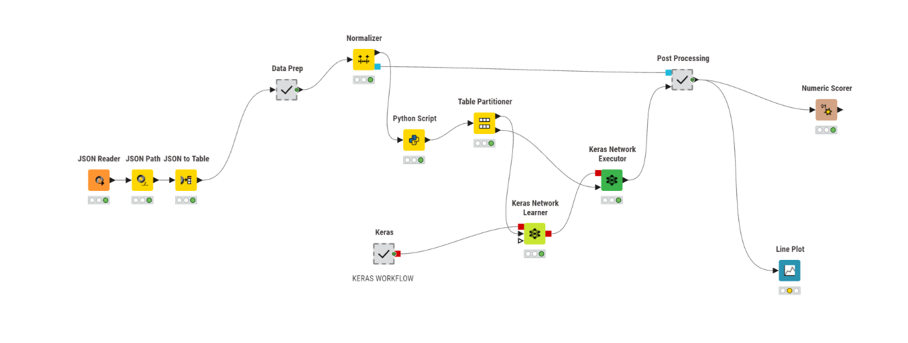

# Localized Climate AI Predictive Pipeline: Breaking the Persistence Trap

An end-to-end data engineering and deep learning pipeline designed to model complex, localized weather transitions in Spain's Mediterranean hotspot. This project highlights the extraction, orchestration, and evaluation of multi-variable historical datasets to train a custom neural network that overcomes traditional seasonal persistence biases.

## 📊 Pipeline Architecture & Workflow

*Visual representation of the integrated data processing, transformation, and modeling pipeline executed inside KNIME and Python.*

## 🛠️ Core Features & Engineering Breakthroughs

* **API Data Orchestration:** Automated ingestion architecture utilizing Postman, Newman, and custom command-line scripts to programmatically mine 30 years of daily historical climate records from state meteorological APIs, processing 10,950 distinct daily JSON files.
* **Data Quality & Anomaly Remediation:** Formulated a rigid validation framework using Python and KNIME to clean raw climate variables, reconcile missing spatial data structures via linear interpolation, and execute cyclical time encoding.
* **Deep Learning Model R&D:** Prototyped a multi-variable Keras Stacked Long Short-Term Memory (LSTM) network to simulate physical environmental risk parameters.
* **Bias Optimization (Beating the Persistence Trap):** Conducted systematic ablation studies to isolate and eliminate model "persistence traps"—where networks fallback on copying the previous day's inputs. By completely isolating target variables from input attributes and deploying Z-score standardization, the model was forced to compute transitions based on true pressure, wind, and solar dynamics.

## 📈 Performance Metrics
* **Model Accuracy ($R^2$):** 0.871
* **Mean Absolute Error (MAE):** 1.56°C

## 📂 Repository Directory Structure
* `/workflow`: Contains the complete, executable `.knwf` file for deployment within the KNIME Analytics Platform.
* `/scripts`: Dedicated Python blocks utilized for local API data handling, data frame cleaning, and feature engineering tasks.
